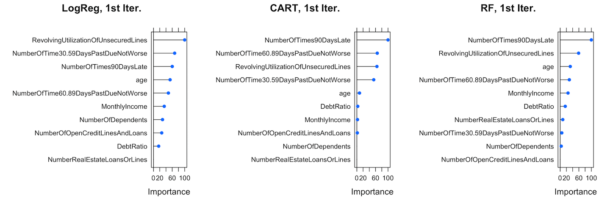
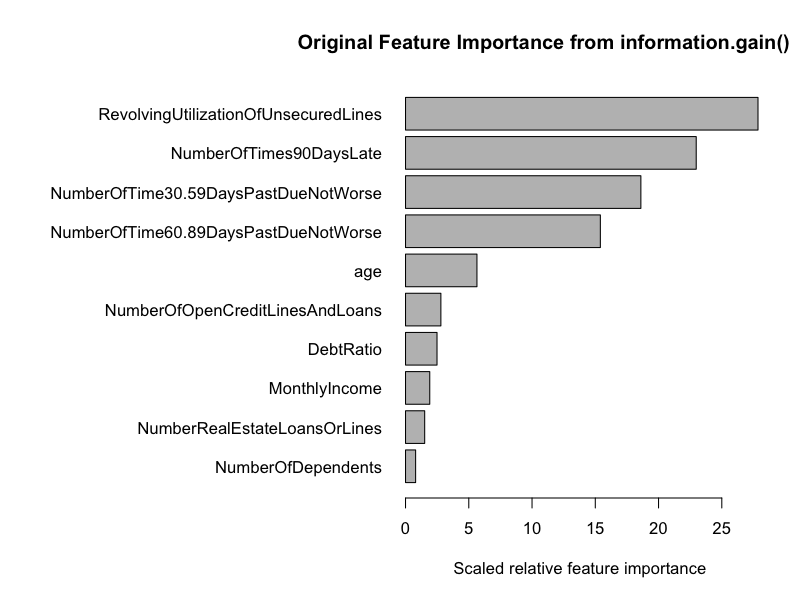
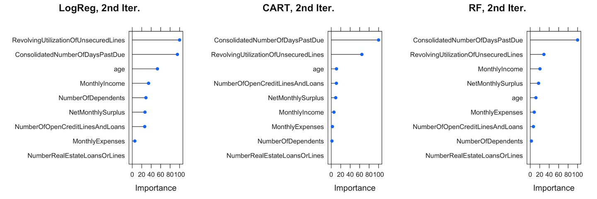
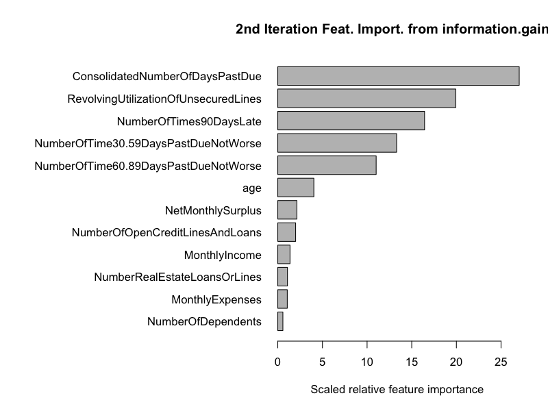
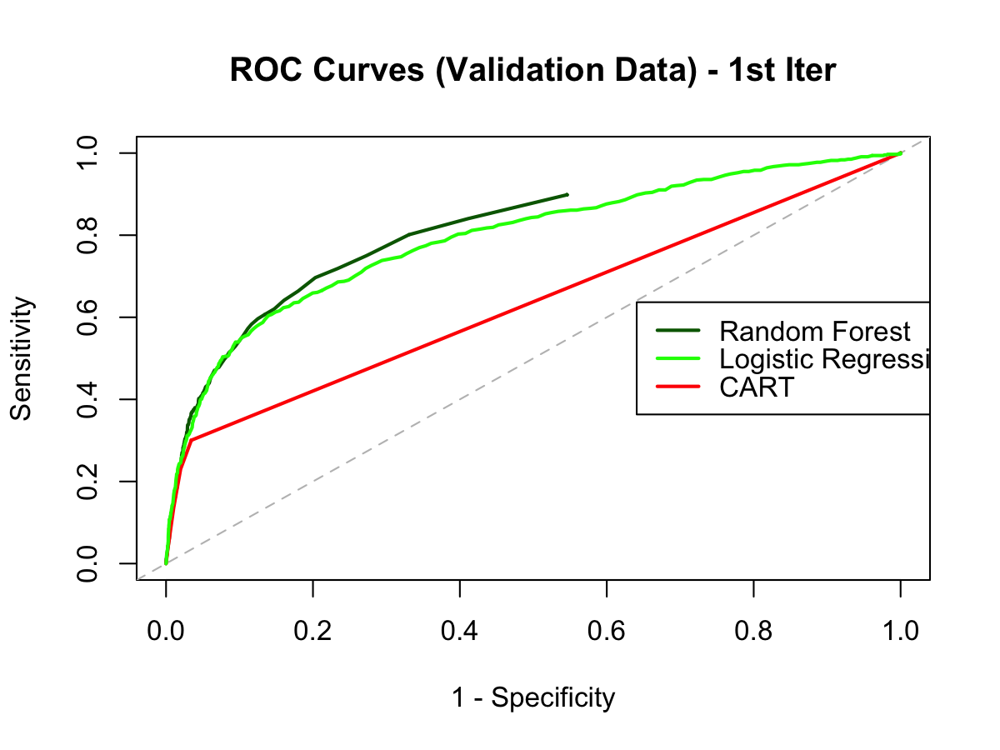
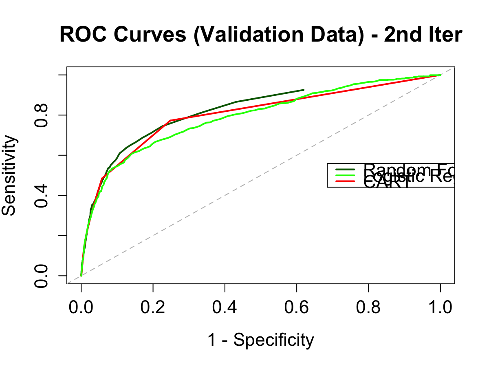

"GiveMeSomeCredit" Capstone project
---
Author: David Crook <david.crook@gmail.com>

# Introduction

A Kaggle project from 2011, "[Give Me Some Credit](https://www.kaggle.com/c/GiveMeSomeCredit)", was chosen for this capstone project. From its project description:

> Improve on the state of the art in credit scoring by predicting the probability that somebody will experience financial distress in the next two years.

The competition was a well-defined **binary classification** problem: make a prediction for provided test dataset on whether a given borrower will be likely to default within two years. This project explored creating various machine learning models on this classification problem.

## More Background

Banks play a crucial role in market economies. They decide who can get finance and on what terms and can make or break investment decisions.[1](#footnote1) Lenders want to issue loans with understandable risks of not getting paid back.

At the heart of the loan decision process is using available borrower information to determine credit-worthiness:

> Credit scoring algorithms, which make a guess at the probability of default, are the method banks use to determine whether or not a loan should be granted. This competition requires participants to improve on the state of the art in credit scoring, by predicting the probability that somebody will experience financial distress in the next two years.[2](#footnote2)

In finance, *default* is failure to meet the legal obligations (or conditions) of a loan, such as when a home buyer fails to make a mortgage payment. Lenders like banks want to predict ahead of time (i.e., before they issue a loan) the chances of a likely "default" ("financial distress") event occurring. 

# Description of the available data

This problem came with a [bundled data set](https://www.kaggle.com/c/GiveMeSomeCredit/data).

| File Name       | Available Formats |
|-----------------|-------------------|
| cs-training     | .csv (7.21 mb)    |
| cs-test         | .csv (4.75 mb)    |
| Data Dictionary | .xls (14.50 kb)   |
| sampleEntry     | .csv (1.82 mb)    |

Counting both the training and test data, there are over `250,000` observations gathered from historical borrowing data.

#### Training set

There is a training dataset (`cs-training.csv`) which includes historical borrowing information on `150,000` borrowers. The training set includes a value for the variable to be predicted: `SeriousDlqin2yrs`. `SeriousDlqin2yrs` is a binary variable of whether "*Person experienced 90 days past due delinquency or worse*".  In the training dataset, **6.68%** of the observations had this variable set to **`1`**. (See [EDA.html](https://dpcrook.github.io/SR_Foundations_DS_Fall_2015/capstone/GiveMeSomeCredit/EDA.html))

#### Test set

The test dataset  (`cs-test.csv`) contains `101,503` observations. These observations *do not* contain a value for the variable to be predicted, `SeriousDlqin2yrs`. The goal in the Kaggle competition was to provide a predicted value-- a probability-- for this variable in each observation in the test dataset.  The entry was then scored using [AUC (Area-Under-Curve)](https://en.wikipedia.org/wiki/Receiver_operating_characteristic#Area_under_the_curve) metric..

*For **extra credit**, the author submitted a prediction entries receiving an "official" AUC grading and ranking among the competition's entries.*

#### Important fields and information in the data set

From the `Data Dictionary.xls` file in the data bundle, there was a description of all the variables in the dataset. `SeriousDlqin2yrs`, a binary variable, is the dependent variable that was to be predicted.

Variable Name                         |  Description                                                                                                                                               |  Type          |
--------------------------------------|------------------------------------------------------------------------------------------------------------------------------------------------------------|----------------|
**SeriousDlqin2yrs**                  |  **Person experienced 90 days past due delinquency or worse**                                                                                              |  **`Y/N`**     |
                                      |                                                                                                                                                            |                |
*Demographics*                        |                                                                                                                                                            |                |
age                                   |  Age of borrower in years                                                                                                                                  |  `integer`     |
NumberOfDependents                    |  Number of dependents in family excluding themselves (spouse, children etc.)                                                                               |  `integer`     |
                                      |                                                                                                                                                            |                |
*Finances*                            |                                                                                                                                                            |                |
DebtRatio                             |  Monthly debt payments, alimony,living costs divided by monthy gross income                                                                                |  `percentage`  |
MonthlyIncome                         |  Monthly income                                                                                                                                            |  `real`        |
                                      |                                                                                                                                                            |                |
*Existing Credit Utilization*         |                                                                                                                                                            |                |
NumberOfOpenCreditLinesAndLoans       |  Number of Open loans (installment like car loan or mortgage) and Lines of credit (e.g. credit cards)                                                      |  `integer`     |
NumberRealEstateLoansOrLines          |  Number of mortgage and real estate loans including home equity lines of credit                                                                            |  `integer`     |
RevolvingUtilizationOfUnsecuredLines  |  Total balance on credit cards and personal lines of credit except real estate and no installment debt like car loans divided by the sum of credit limits  |  `percentage`  |
                                      |                                                                                                                                                            |                |
*Deliquencies*                        |                                                                                                                                                            |                |
NumberOfTime30-59DaysPastDueNotWorse  |  Number of times borrower has been 30-59 days past due but no worse in the last 2 years.                                                                   |  `integer`     |
NumberOfTime60-89DaysPastDueNotWorse  |  Number of times borrower has been 60-89 days past due but no worse in the last 2 years.                                                                   |  `integer`     |
NumberOfTimes90DaysLate               |  Number of times borrower has been 90 days or more past due.                                                                                               |  `integer`     |

# Data Cleaning Details

Like any other real-world data set, the data contained outliers, missing values, and other suspect details. The author has included more extensive notes, comments, and the `R` code in [EDA.Rmd](GiveMeSomeCredit/EDA.Rmd). Below, details are provided on the `cs-training` dataset.

### General

The first column in the dataset is the observation number. This variable had no possible predictive value and was deleted from the data table. Otherwise the provided dataset was *tidy*, with each row a complete observation, and each column a variable.

#### Demographics variables

**age** - One of the `age` values is `0` and is invalid. The author chose to **impute** a value for it.
Many values in the `age` variable over age 90 and even over age 100. These seemed possibly invalid, but no changes were made to these values.

**NumberOfDependents** - There are a couple of suspect outliers (>10) in this variable, but otherwise values seems reasonable. Contained **NA** values. For the **NA** `NumberOfDependents`, it was chosen to **impute** values. Another technique could have been setting the values to the sample *median* or sample *mean*.

#### Finances variables

**DebtRatio** - The `DebtRatio` variable contained a large spread with some very high values. In the training dataset, it had a *median* of `0.4` and *mean* of `353`.
During additional investigation, it was found that `DebtRatio` was computed by substituting `1` to `MonthlyIncome`, where `MonthlyIncome` was not available.[3](#footnote3) This knowledge was leveraged when creating the feature `MonthlyExpenses` (refer below).

**MonthlyIncome** - There were a large number of outliers in `MonthlyIncome`, and it contained **NA**s. Rather than converting to its *median* value, the **NA** values were **imputed**.

**MonthlyExpenses**  [**Constructed**] - `DebtRatio` multipled by `MonthlyIncome`. Where `MonthlyIncome` was **NA**, `1` was substituted for `MonthlyIncome` to reflect what was done in original dataset. This feature is a way to get a value for monthly expenses, instead of the included ratio. It intends to remove non-linearity present in `DebtRatio` due to the way it was defined.

**NetMonthlySurplus**  [**Constructed**] - `MonthlyIncome` minus the constructed feature `MonthlyExpenses`. This feature is intended to represent net income, and if negative it reflects a net monthly deficit.

#### Existing Credit Utilization variables

**NumberOfOpenCreditLinesAndLoans**, **NumberRealEstateLoansOrLines** - A few of these seem unrealistically high, but were assumed to be valid.
**RevolvingUtilizationOfUnsecuredLines** - There were extreme outliers in this variable. 

#### Deliquencies variables

**NumberOfTime30-59DaysPastDueNotWorse**, **NumberOfTime60-89DaysPastDueNotWorse**, **NumberOfTimes90DaysLate**
There are `5` occurrences of `96` and `264` occurrences of `98` in each of these variables. It was established that these are nonsensical values, and were converted to **NA**.  The values were then set to their sample *median*. Otherwise the values in these variables were assumed to be reasonable and valid.

**ConsolidatedNumberOfDaysPastDue** [**Constructed**] - Since the three Delinquencies variables are related, it was decided to create a feature `ConsolidatedNumberOfDaysPastDue` that contained the total number of days late.  Using the assumed thresholds `[30, 60, 90]`, respectively, the feature `ConsolidatedNumberOfDaysPastDue` was created. The thinking was that, for model fitting, it could be useful to use the total number of days to represent the three variables on a linear basis.

## Data cleaning techniques

#### Imputing values

The `mice` [R package](https://cran.r-project.org/web/packages/mice/index.html) (`mice`: "Multivariate Imputation by Chained Equations") was chosen to **impute** the **NA** values. (refer to [EDA.Rmd](GiveMeSomeCredit/EDA.Rmd) code at `imputed = complete(mice(simplified))`. *Imputation* is a method to fill in missing values in a dataset so they resemble the dataset as a whole.  Since the imputation process takes a lot of wall clock time and can be resolved differently each run due to randomization inherent in the technique, the imputation process was executed once. The resulting imputed values were stored in a file (`imputed_simplified.Rda`) for reuse.

In the training dataset, the variables `age` (actually a `0` converted to **NA**), `MonthlyIncome`, and `NumberOfDependents` contained **NA** values. For these variables with **NA**s, the values were **imputed** using `mice` library.

#### Nonsensical encoded values

The variables  `NumberOfTime30-59DaysPastDueNotWorse`, `NumberOfTime60-89DaysPastDueNotWorse`, `NumberOfTimes90DaysLate` effectively contained **NA** values (encoded values of `96` and `98` which meant the data was not available). The **NA**s in these variables were set to the variable's *median* values.

The resulting cleaned data was saved to a file `cs-training-cleaned.csv`, to be used as-is as input in [Modeling.Rmd](GiveMeSomeCredit/Modeling.Rmd).

## Feature Engineering

### Feature construction

After analysis and exploration of the provided training dataset, a few features were constructed as discussed in an above section.  A summary of constructed features is included here:

Feature                              | Description
-------------------------------------|------------
**MonthlyExpenses**                  | `DebtRatio` multipled by `MonthlyIncome`
**NetMonthlySurplus**                | `MonthlyIncome` minus the constructed feature `MonthlyExpenses`
**ConsolidatedNumberOfDaysPastDue**  | Calculated as "total" number of days past due in each observation, scaling `NumberOfTime30-59DaysPastDueNotWorse`, `NumberOfTime60-89DaysPastDueNotWorse`, `NumberOfTimes90DaysLate` by `30`, `60`, and `90` respectively, and summing the values.

During the first iteration of model building, these constructed variables were not included in model training. In the second iteration they were, at some exclusion of variables they were created from.  Between the first and second iterations, the variables used to build the model was the only thing changed.  The results can be observed in the *Modeling* section below.

### Feature importance

In a classification problem, it is often useful to determine which features might be useful as the most important predictors. 

Feature importance was gathered for each model's variables after each model was trained.

#### First model iteration

Here are comparisons with each model's variable importance:

Here is what the `FSelector` library function `information.gain()` had calculated for feature importance when run on the cleaned data set on the original features:

This `FSelector` feature analysis was performed *after the modeling stage* (the author was unfamiliar with it until after the modeling work had been completed) but it agrees pretty closely with what the first iteration classification tree found for its important variables.

#### Second model iteration

Here are comparisons with each model's variable importance from the second iteration of model building:

Here is what the  `information.gain()` had calculated for feature importance on the same variables:

Again there is strong correspondence with with what the classification tree reported for its important variables. 

Something interesting to note is that both the Random Forest model and the CART model have a very strong predictor in `ConsolidatedNumberOfDaysPastDue` in the second iteration models, but the logistic regression model had include `RevolvingUtilizationOfUnsecuredLines` as its slightly more important variable.

## Feedback to data providers

Better input data can lead to better models and better results.

- Try to be consistent on provided variables in a data source.  Numeric variables should be linear and defined consistently at least within the same variable where possible. For example, `DebtRatio` was sometimes a placeholder used to represent monthly expense values, and other times was defined as an actual ratio.  Also, ratios (or any term that arises from a division) can have division-by-zero issues, and should be avoided.

- If any variables use encoded values, note that in the data dictionary and try to describe what these are.  Encoded values in an otherwise linear variable can be confusing and misleading to models.

- Provide additional guidance and meaning of outliers in variables. 

### *What other data could be good to have?* 

Something that seemed missing in the datasets were borrower total assets and total liabilities.  It would have been interesting to see those variables in the dataset, especially since all loan applications the author is familiar required that data.

# Modeling 

Models were built and used to evaluate among the **decision tree** (CART), **random forest**, and **logistic regression** binary classifiers.  These approaches were selected since they were the ones covered in the coursework.  Full R code with comments and many other details on the model builds and evaluation can be found in [Modeling.Rmd](GiveMeSomeCredit/Modeling.Rmd) (.html output: [Modeling.html](https://dpcrook.github.io/SR_Foundations_DS_Fall_2015/capstone/GiveMeSomeCredit/Modeling.html)). 

## Data selection and model building

Since the `cs-test.csv` dataset did not include values for the dependent variable `SeriousDlqin2yrs`, it was not usable for evaluating and validating the models created from the training data. Instead, the training dataset was split up to use for purposes of model evaluation and validation.

The **`createDataPartition`** function from the **`caret`** [R package](https://cran.r-project.org/web/packages/caret/index.html) (`caret`: "Classification and Regression Training") was use to split samples representationally (and randomly) so that each split sample would reflect the source sample on the proportion of the dependent variable being expressed.

#### CART (Classification And Regression Tree) model

The CART model (use in classification tree) ran multiple iterations to tune `cp` parameter, as covered in course materials.

#### Logistic Regression model

A standard logistic regression model was built, tuned by complexity parameter `aic`.

#### Random Forest model

A random forest model was created with the number of trees set to `600` and nodesize of `100`.  These values were reasonable considering the training sample split size.

#### `caret` and cross-validation

The `caret` package is very versatile; it contains wrappers and consistent parameterizations for each of the three types of classification models being explored and a whole host of other modeling techniques not discussed here.  It simplified support for running different classfication model methods.  See the [Modeling.Rmd](GiveMeSomeCredit/Modeling.Rmd) for full details on how it was used in this project.

For cross-validation, the setting used was repeated k-fold cross validation, where `k` was `5` and `repeats` was set to `2`.  This is done in an attempt to avoid over-fitting the model to the model training dataset.

### First Iteration Evaluation

For the first iteration of the modeling, no features were de-selected and all original variables from the dataset were used. Similarly, no constructed features were included in the modeling. The ROC (Receiver Operating Characteristic) curve comparing the three first-iteration models:

"Validation Data" in the chart caption refers to the split of the training dataset that was used for model validation.

The Random Forest model performs best in the first iteration, but the Logit (logistic regression) model keeps up, finally stalling around a *sensitivity* of `0.6` or so.  The CART model does not really do all that well in the first iteration.

### Second Iteration Evaluation - feature selection

For the second iteration model builds, the non-linear `DebtRatio` variable was removed, while `MonthlyExpenses` and `NetMonthlySurplus` were added. Also, the three "PastDue" variables were replaced with `ConsolidatedNumberOfDaysPastDue` that is intended to represent their linear sum. This was an attempt to remove some of the non-linearities identified in the existing variables in the dataset.

When the models were rebuilt with the changed features, the resulting ROC curve looked like:

In the second iteration, all three models performed at least slightly better on the ROC curve.

The Random Forest model improving significantly, and the CART model showed the greatest performance improvement. The Random Forest performed the best overall of the three models again.

### Model Validation

Each of the first and second iteration models were validated against a reserve 

# Extra Credit - Submitted on Kaggle

For extra credit, it was decided that actual predictions could be submitted to kaggle website.  The competition will still grade user submissions according to the competition rules.  For details, including code, refer to: [ExtraCredit.Rmd](GiveMeSomeCredit/ExtraCredit.Rmd).

A CART model and a Random Forest model were built.

The Random Forest model parameters were changed to reflect a larger number of observations in the training set for the first Random Forest submission.  Even so, the RF model took multiple hours to build on the author's workstation. 

The models were trained using the the independent variables grouped that was used in the second iteration above. They were trained using the *entire training dataset*. In the other models above, splits of the training data were reserved for model testing and model validation.  A small change was made to the RF model to shorten build time (`nodesize` changed from `100` to `300`).
Each was submitted on the kaggle site, and their results are included in [ExtraCredit.html](https://dpcrook.github.io/SR_Foundations_DS_Fall_2015/capstone/GiveMeSomeCredit/ExtraCredit.html).

### Kaggle submission results

Since time permitted, `nodesize` was changed to `100` and model was rebuilt. The run took over `2.5` hours, but yielded a better performing model. It was scored an **AUC** of **`0.832493`** and a rank of 713 out of 925, better than one-fifth of the entries.

# Ideas for future research

- The Random Forest generation took a large amount of wall clock time to build its model, especially when using most of the training set. During iteration, the author was forced to greatly reduce to training set size in order to iterate experiments in a reasonable amount of time. Investigations into parallel computation for speedup would help on this aspect.

- Come up with a better strategy to clip or cull extreme outliers in the provided training and test data, or otherwise normalize them.  Some of the variables in the training data set had outliers of many orders of magnitude beyond the inter-quartile range.  For example, in `RevolvingUtilizationOfUnsecuredLines` the extreme outliers should have been clipped.

- Run experiments on the best ways of filling in **NA** values for this dataset.  Compare methods of imputation and other traditional ways.
  - Perhaps impute the missing values in `MonthlyIncome` and `NumberOfDependents` using *both* the included training and test datasets as one combined sample. The test dataset also had **NA**s for these variables, and the author ended up *imputing* the values separately in order to make predictions on the test dataset for the extra credit portion.

### Boosting and Other Binary Classifiers

The following binary classifiers[4](#footnote4) were not covered in the course, but could be tried to observe if any of them would create higher-performing models:

- Bayesian networks
- Support vector machines
- Neural networks

Many kaggle competitors employ "ensemble" method where multiple machine learning models are built and *combined* for an overall output.

#### Boosting

Another technique, boosting, could additionally be used to improve upon the model result. This method was not covered in course materials, but can often lead to better predictive models.

Like Random Forests, boosting is an ensemble method in that the overall fit is produced from many trees. In Boosting[5](#footnote5):

1. Fit the data with a single tree.
1. Crush the fit so that it does not work very well.
1. Look at the part of `y` (dependent variable) not captured by the crushed tree and fit a new tree to what is “left over”.
1. Crush the new tree. The new fit is the sum of the two trees.
1. Repeat the above steps iteratively. At each iteration, a fit is made on “what is left over” with a tree, the tree is crushed, and then the new crushed tree is added into the fit.
1. The final fit is the sum of many trees.

## Footnotes

<b id="footnote1">1</b> From https://www.kaggle.com/c/GiveMeSomeCredit description [↩](#afootnote1)

<b id="footnote2">2</b> Again, from https://www.kaggle.com/c/GiveMeSomeCredit description [↩](#afootnote2)

<b id="footnote3">3</b> https://www.kaggle.com/c/GiveMeSomeCredit/forums/t/1166/congratulations-to-the-winners/7231#post7231 [↩](#afootnote3)

<b id="footnote4">4</b> Taken from [Binary classification](https://en.wikipedia.org/wiki/Binary_classification)  [Wikipedia]  [↩](#afootnote4)

<b id="footnote5">5</b> http://chicagoboothml.github.io/MachineLearning_Fall2015/Syllabus/03_trees_bag_boost.pdf  [↩](#afootnote5)

