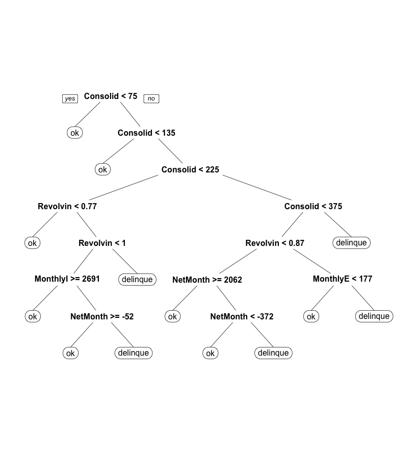

Output: [ExtraCredit.html](https://dpcrook.github.io/SR_Foundations_DS_Fall_2015/capstone/GiveMeSomeCredit/ExtraCredit.html)


# Extra credit : Kaggle competition entry

Setup

``` {r Setup, message=FALSE, warning=FALSE, echo=FALSE}
setwd("~/projects/Classes/FoundationsOfDataScience_sliderule/github/capstone/GiveMeSomeCredit")

# need these for decision tree graph
library(rpart)
library(rpart.plot)

library(caret)
library(data.table)
library(mice)

source('EvaluationMetrics.R')
```

``` {r Set seed}
# set randomizer's seed
set.seed(142)
```

Use Random Forest with model to make a prediction set.

Read in training data:

``` {r}

# read in cleaned version saved by EDA.Rmd
cs <- read.csv("cs-training-cleaned.csv")

# restore levels to factors
cs$SeriousDlqin2yrs <- factor(cs$SeriousDlqin2yrs, 
                              levels = c(0, 1), labels = c("ok", "delinquent"))
#str(cs)
```


# build models

## Classification Models

There will be built three types of classification models: a Classification (CART) Tree, a Random Forest, and a Logistic Regression.


```{r caret parameters}

# set up some turning and cross-validation parameters that will be used across
# the classifiers
caret_optimized_metric <- 'logLoss'   # equivalent to 1 / 2 of Deviance

caret_train_control <- trainControl(
  classProbs=TRUE,             # compute class probabilities
  summaryFunction=mnLogLoss,   # equivalent to 1 / 2 of Deviance
  method='repeatedcv',         # repeated Cross Validation
  number=5,                    # 5 folds
  repeats=2,                   # 2 repeats
  allowParallel=FALSE)

x_vars_features = c(
  'RevolvingUtilizationOfUnsecuredLines',
  'age',
  'MonthlyIncome',
  'MonthlyExpenses',
  'NetMonthlySurplus',
  'NumberOfOpenCreditLinesAndLoans',
  'NumberRealEstateLoansOrLines',
  'NumberOfDependents',
  'ConsolidatedNumberOfDaysPastDue'
  )
```

### CART

```{r CART model extra credit, message=FALSE, warning=FALSE}

# cp values
cp.gridxc = expand.grid( .cp = seq(0.0001, 0.003, 0.0001))

# Use the whole training data set and the constructed features
cart_modelxc = train(
  x=cs[, x_vars_features],
  y=cs$SeriousDlqin2yrs,
  method='rpart',     # CART
  metric=caret_optimized_metric,
  trControl=caret_train_control,
  tuneGrid = cp.gridxc
  )
cart_modelxc

# show the tree for the tuned .cp value 
cart_modelxc.best.tree = cart_modelxc$finalModel
prp(cart_modelxc.best.tree)
```

Saved copy of tree:



### Random Forest xc

```{r Random forest xc, message=FALSE, warning=FALSE}
B <- 600

rf_modelxc <- train(
  x=cs[, x_vars_features],
  y=cs$SeriousDlqin2yrs,
  method='rf',        # Random Forest
  metric=caret_optimized_metric,
  ntree=B,            # number of trees in the Random Forest
  nodesize=300,       # minimum node size set small enough to allow for complex trees,
                      # but not so small as to require too large B to eliminate high variance
  importance=TRUE,    # evaluate importance of predictors
  keep.inbag=TRUE,
  trControl=caret_train_control,
  tuneGrid=NULL)
```

# competition test data for predictions

Read in test data:

``` {r}

cs.test <- read.csv("cs-test.csv")
str(cs.test)

# Gets rid of the "X" column
cs.test <- rbind(cs.test)[ , -1]  

# convert SeriousDlqin2yrs in testdata to numeric
cs.test$SeriousDlqin2yrs <- as.numeric(cs.test$SeriousDlqin2yrs)

nbt_samples <- nrow(cs.test)
nbt_samples

str(cs.test)
summary(cs.test)
```

clean up the data, and impute missing values

``` {r}

# create a derived variable called MonthlyExpenses taking the above NA
# disposition into account
cs.test$MonthlyExpenses <- ifelse(is.na(cs.test$MonthlyIncome),
                             1 * cs.test$DebtRatio,
                             cs.test$MonthlyIncome * cs.test$DebtRatio)

# create another derived variable called NetMonthlySurplus
cs.test$NetMonthlySurplus <- ifelse(is.na(cs.test$MonthlyIncome),
                             0 - cs.test$MonthlyExpenses,
                             cs.test$MonthlyIncome - cs.test$MonthlyExpenses)


# Convert these to NA, and the variable to numeric
cs.test$NumberOfTime30.59DaysPastDueNotWorse <- as.numeric(ifelse(cs.test$NumberOfTime30.59DaysPastDueNotWorse >= 96, NA,
                                                  cs.test$NumberOfTime30.59DaysPastDueNotWorse))

cs.test$NumberOfTime60.89DaysPastDueNotWorse <- as.numeric(ifelse(cs.test$NumberOfTime60.89DaysPastDueNotWorse >= 96, NA,
                                                  cs.test$NumberOfTime60.89DaysPastDueNotWorse))

cs.test$NumberOfTimes90DaysLate <- as.numeric(ifelse(cs.test$NumberOfTimes90DaysLate >= 96, NA,
                                     cs.test$NumberOfTimes90DaysLate))


# convert the NAs back to their variable's mean
m30 <- mean(cs.test$NumberOfTime30.59DaysPastDueNotWorse, na.rm = TRUE)
m60 <- mean(cs.test$NumberOfTime60.89DaysPastDueNotWorse, na.rm = TRUE)
m90 <- mean(cs.test$NumberOfTimes90DaysLate, na.rm = TRUE)

cs.test$NumberOfTime30.59DaysPastDueNotWorse <- ifelse(is.na(cs.test$NumberOfTime30.59DaysPastDueNotWorse),
                                                  m30,
                                                  cs.test$NumberOfTime30.59DaysPastDueNotWorse)

cs.test$NumberOfTime60.89DaysPastDueNotWorse <- ifelse(is.na(cs.test$NumberOfTime60.89DaysPastDueNotWorse),
                                                  m60,
                                                  cs.test$NumberOfTime60.89DaysPastDueNotWorse)

cs.test$NumberOfTimes90DaysLate <- ifelse(is.na(cs.test$NumberOfTimes90DaysLate),
                                     m90,
                                     cs.test$NumberOfTimes90DaysLate)

# create the ConsolidatedNumberOfDaysPastDue
cs.test$ConsolidatedNumberOfDaysPastDue <- (cs.test$NumberOfTime30.59DaysPastDueNotWorse * 30) +
  (cs.test$NumberOfTime60.89DaysPastDueNotWorse * 60) +
  (cs.test$NumberOfTimes90DaysLate * 90)

# summary(cs.test)
```

# run imputation

`MonthlyIncome` and `NumberOfDependents` contain **NA**s

``` {r}
set.seed(144)

# Multiple imputation
simplifiedxc = cs.test[c("age", 
  'RevolvingUtilizationOfUnsecuredLines',
  'MonthlyIncome',
  'MonthlyExpenses',
  'NetMonthlySurplus',
  'NumberOfOpenCreditLinesAndLoans',
  'NumberRealEstateLoansOrLines',
  'NumberOfDependents',
  'ConsolidatedNumberOfDaysPastDue'
  )]

### This takes a long time so save the results
#imputedxc = complete(mice(simplifiedxc))
#save(imputedxc,file="imputed_testxc.Rda")
load("imputed_testxc.Rda")  # load value in R object 'imputedxc'

# save results
cs.test$MonthlyIncome <- imputedxc$MonthlyIncome
cs.test$NumberOfDependents <- imputedxc$NumberOfDependents
```

# generate predictions

CART 

``` {r}
cartxc_test_pred_probs <- predict(
  cart_modelxc, newdata=cs.test[, x_vars_features], type='prob')
summary(cartxc_test_pred_probs)

results <- data.frame(Id = 1:nrow(cs.test), Probability = cartxc_test_pred_probs[, 2])
write.table(results, "cartEntry.csv", quote=F, row.names=F, sep=",")
```

Random Forest 

``` {r}
rfxc_test_pred_probs <- predict(
  rf_modelxc, newdata=cs.test[, x_vars_features], type='prob')
summary(rfxc_test_pred_probs)

results <- data.frame(Id = 1:nrow(cs.test), Probability = rfxc_test_pred_probs[, 2])
str(results)
write.table(results, "rfEntry.csv", quote=F, row.names=F, sep=",")

```

# Submit predictions

On the final [leaderboard at Kaggle](https://www.kaggle.com/c/GiveMeSomeCredit/leaderboard), there were a total of `925` team submissions. The winning entry from team "Perfect Storm" had a AUC of `0.869558`.

### The CART submission 


It's AUC was scored at **`0.702828`**. It would have ranked at `820`.

### The Random Forest submission


It's AUC was scored at **`0.794789`**. It would have ranked at `772`. This placement is only better than **`r formatC(100 * (1  - 772/925), format='f', digits=2)`** of competitor team entries, or about one-sixth of the entries.

Getting an increase in AUC of **`r formatC(0.869558 - 0.794789, format='f', digits=6)`** would have been required to win the competition.
